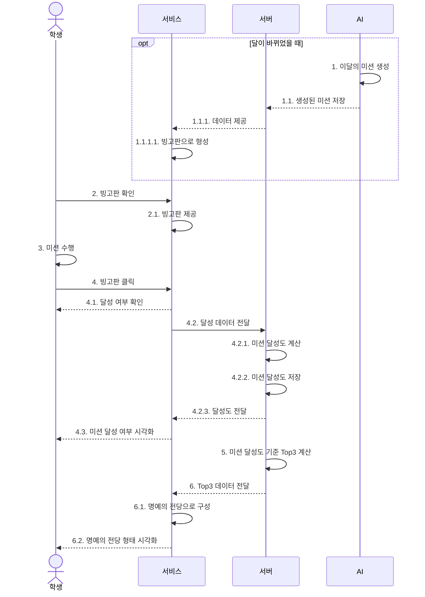

# 미션빙고 — 드라이브 보관본

[Mermaid 코드](mission-bingo-drive.mmd) · [원본](../mission-bingo.png) · [목록](README.md)

보관 이미지의 요소와 관계를 Mermaid로 복원했습니다. 배치는 자동으로 재구성됩니다.

PDF 3쪽과 구성이 다른 드라이브 보관본을 별도로 복원했습니다.

```mermaid
sequenceDiagram
    actor Student as 학생
    participant Service as 서비스
    participant Server as 서버
    participant AI as AI
    opt 달이 바뀌었을 때
        AI->>AI: 1. 이달의 미션 생성
        AI-->>Server: 1.1. 생성된 미션 저장
        Server-->>Service: 1.1.1. 데이터 제공
        Service->>Service: 1.1.1.1. 빙고판으로 형성
    end
    Student->>Service: 2. 빙고판 확인
    Service->>Service: 2.1. 빙고판 제공
    Student->>Student: 3. 미션 수행
    Student->>Service: 4. 빙고판 클릭
    Service-->>Student: 4.1. 달성 여부 확인
    Service->>Server: 4.2. 달성 데이터 전달
    Server->>Server: 4.2.1. 미션 달성도 계산
    Server->>Server: 4.2.2. 미션 달성도 저장
    Server-->>Service: 4.2.3. 달성도 전달
    Service-->>Student: 4.3. 미션 달성 여부 시각화
    Server->>Server: 5. 미션 달성도 기준 Top3 계산
    Server-->>Service: 6. Top3 데이터 전달
    Service->>Service: 6.1. 명예의 전당으로 구성
    Service-->>Student: 6.2. 명예의 전당 형태 시각화
```
