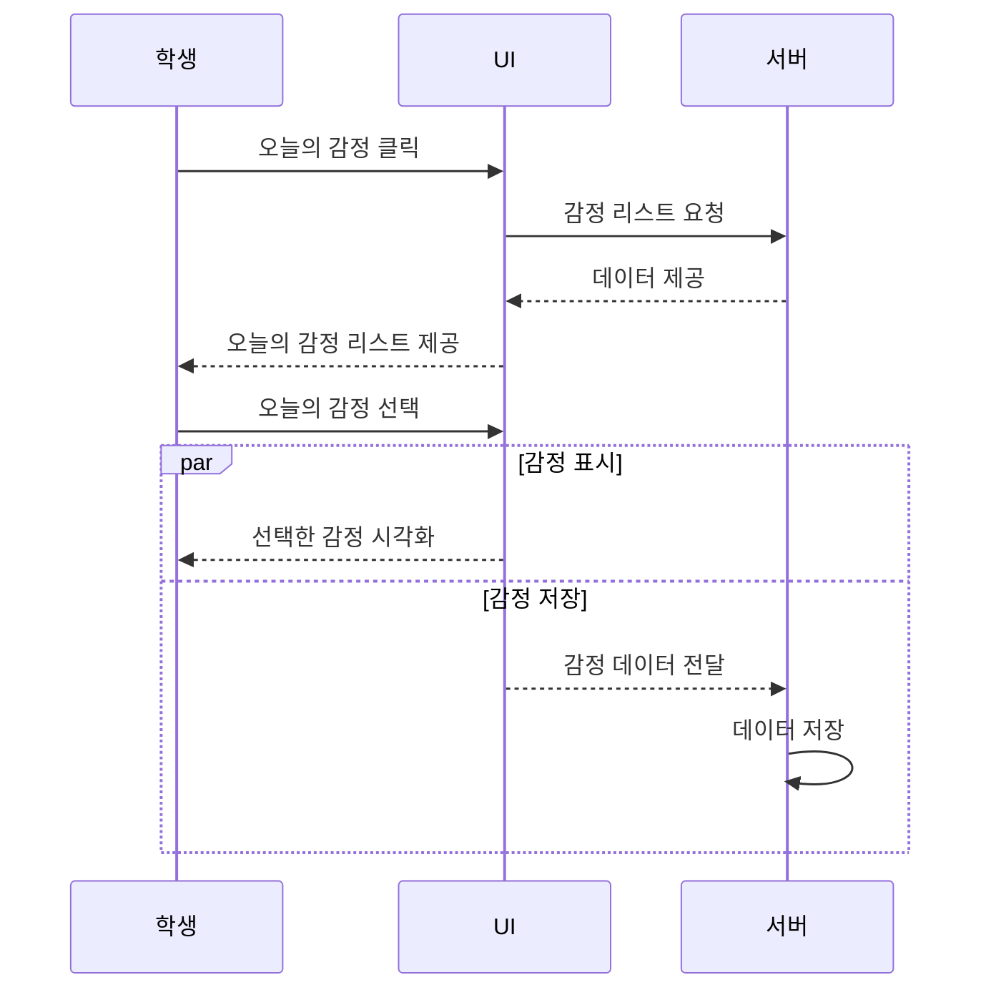

# 감정 대시보드

[Mermaid 코드](sequence-04-mood.mmd) · [원본](../sequence.pdf#page=4) · [목록](README.md)

보관 이미지의 요소와 관계를 Mermaid로 복원했습니다. 배치는 자동으로 재구성됩니다.

```mermaid
sequenceDiagram
    participant Student as 학생
    participant UI as UI
    participant Server as 서버
    Student->>UI: 오늘의 감정 클릭
    UI->>Server: 감정 리스트 요청
    Server-->>UI: 데이터 제공
    UI-->>Student: 오늘의 감정 리스트 제공
    Student->>UI: 오늘의 감정 선택
    par 감정 표시
        UI-->>Student: 선택한 감정 시각화
    and 감정 저장
        UI-->>Server: 감정 데이터 전달
        Server->>Server: 데이터 저장
    end
```
