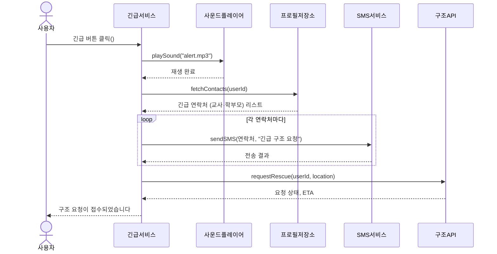

# 긴급 버튼·구조 요청

[Mermaid 코드](sequence-05-emergency.mmd) · [원본](../sequence.pdf#page=5) · [목록](README.md)

보관 이미지의 요소와 관계를 Mermaid로 복원했습니다. 배치는 자동으로 재구성됩니다.

```mermaid
sequenceDiagram
    actor User as 사용자
    participant Emergency as 긴급서비스
    participant Player as 사운드플레이어
    participant Profile as 프로필저장소
    participant SMS as SMS서비스
    participant Rescue as 구조API
    User->>Emergency: 긴급 버튼 클릭()
    Emergency->>Player: playSound("alert.mp3")
    Player-->>Emergency: 재생 완료
    Emergency->>Profile: fetchContacts(userId)
    Profile-->>Emergency: 긴급 연락처 (교사·학부모) 리스트
    loop 각 연락처마다
        Emergency->>SMS: sendSMS(연락처, "긴급 구조 요청")
        SMS-->>Emergency: 전송 결과
    end
    Emergency->>Rescue: requestRescue(userId, location)
    Rescue-->>Emergency: 요청 상태, ETA
    Emergency-->>User: 구조 요청이 접수되었습니다
```
